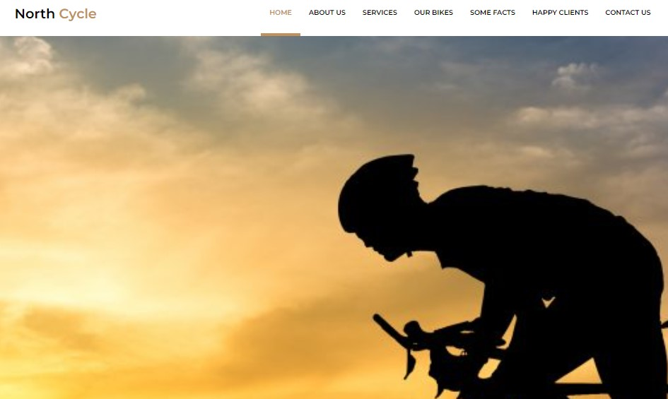

## North Cycle !  🚴‍♂️🚴‍♀️
 

##  North Cycle, um landing page simples sobre bikes, com HTML5 Semântico e CSS3 conceitos de flexbox e responsive. 💻 📚
 

## Tecnologias que utilizei para o projeto ;  

 
    
    

 

## Projeto 🥰

### [North Cycle](https://alisson-aguiars2k.github.io/north-cycle/) 🔗